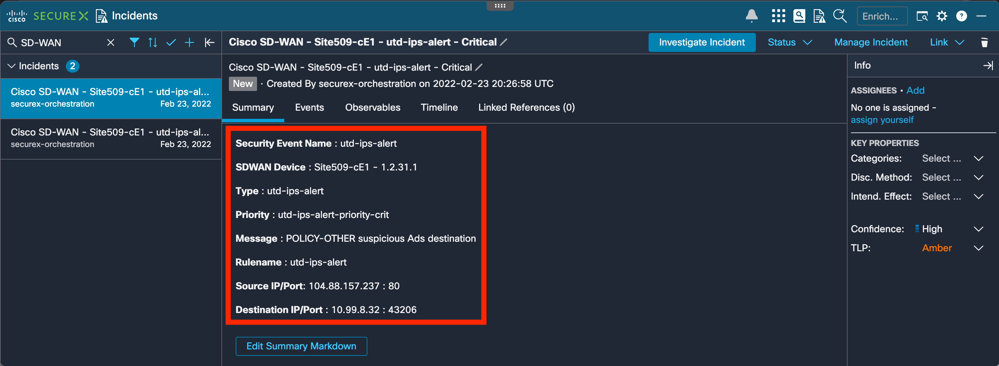
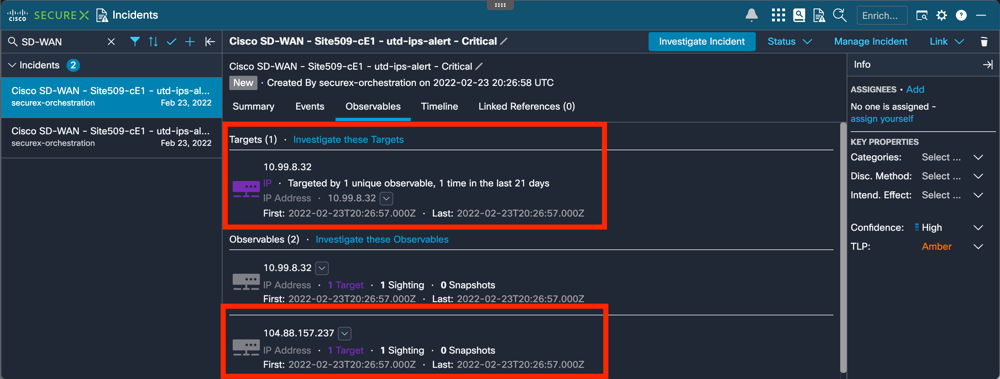
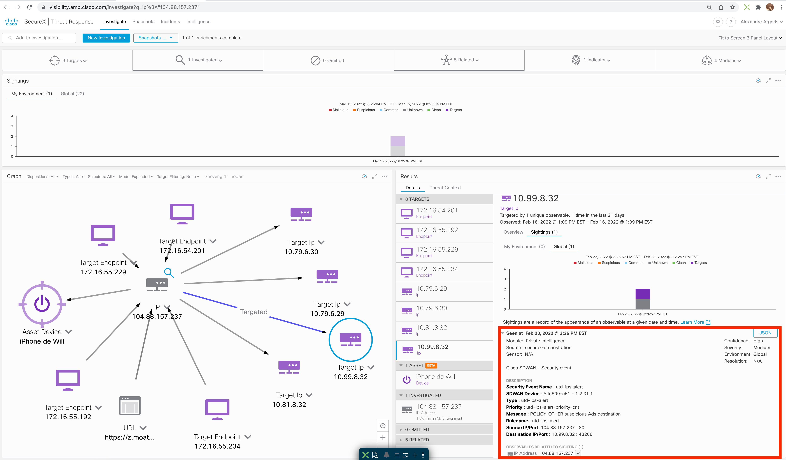
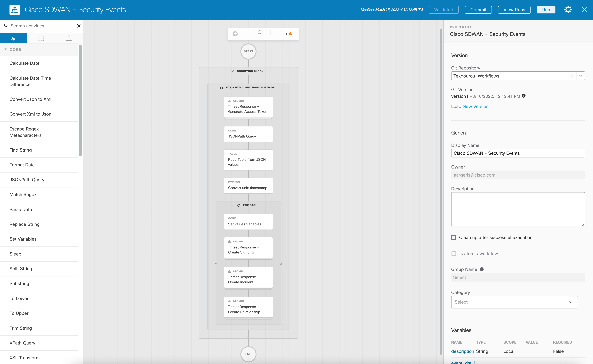
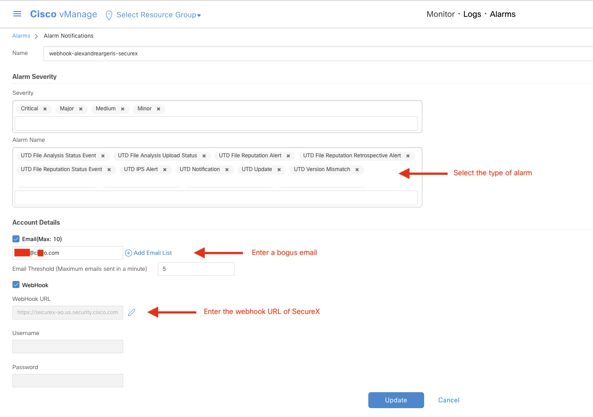

# Cisco SDWAN (vManage) integration with Cisco SecureX

This workflow will be trigger via webhook recieved by vManage. 
 
> **Note:** This workflow is work in progress and will be enhanced. Please see this as `v1`.

## SecureX incidents created from vManage Security events detected on devices.

## Cisco SecureX Orchestration workflow

## Importing SecureX Orchestration workflow

1. Click import in SecureX orchestration:

2. Import the [workflow](https://raw.githubusercontent.com/tekgourou/sxo-workflows/main/ciscoSdwanSecurityEvents__definition_workflow_01UTZ5EK3CSKR0gxHUSFAJPVtuW0Ht4lf2D/definition_workflow_01UTZ5EK3CSKR0gxHUSFAJPVtuW0Ht4lf2D.json by copy pasting the JSON in to SecureX orchestration **IMPORT** pane:

## vManage configuration

## Enjoy and stay safe!
