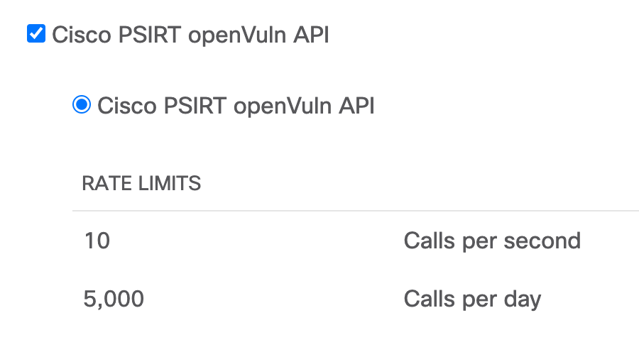
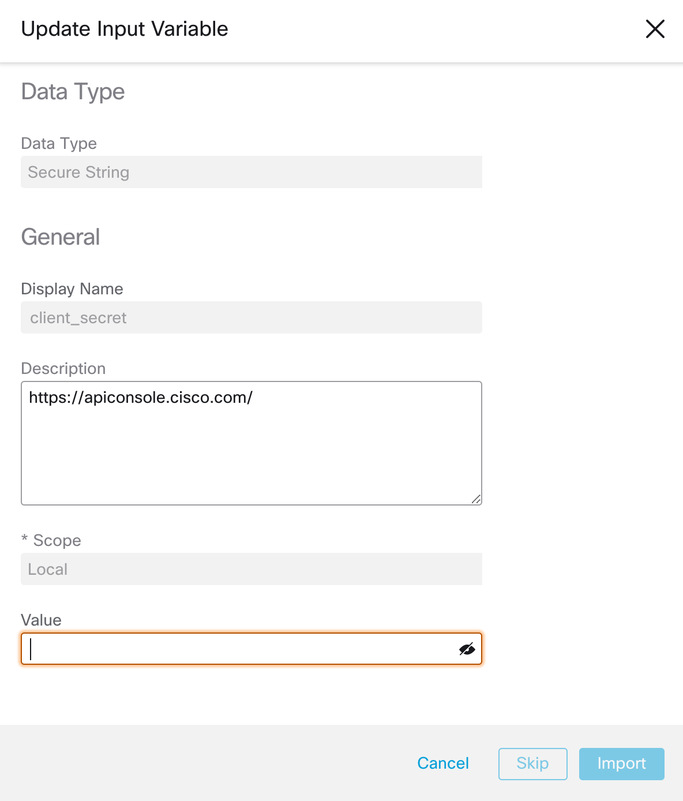
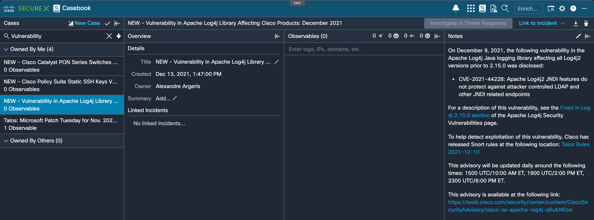

# Cisco Security Advisory (Critical Impact) to SecureX Casebook and Webex 

This workflow fetches Critical Impact Security Advisories from the last week from Cisco PSIRT API every hour.  If there are any new advisories, or if an existing advisory is updated, the table is updated, a SecureX Casebook is created and optionally a Webex notification is sent. It is very important to stay up to date with these advisory updates, to minimize the chance of a cyber attack to your organization.
 
> **Note:** This workflowMore info on "Cisco PSIRT openVuln API": https://developer.cisco.com/docs/psirt/#!overview/overview

> **Note:** This workflow is work in progress and will be enhanced. Please see this as `v0`.

## Creating Cisco PSIRT openVuln API credentials
1. Browse to https://apiconsole.cisco.com/apps/register and log in with Cisco ID.
2. Enter a name for the app (e.g. Cisco PSIRT openVuln API SecureX orchestration):

3. Select "Cisco PSIRT openVuln API", agree to the terms and click register.

4. Now check your email, you will have received the API key (client_id) there.
5. Browse to https://apiconsole.cisco.com/apps/mykeys to find your API secret (client_secret).
6. We will use these keys in the subsequent steps.

## Importing the workflow
1. Click import in SecureX orchestration:

2. Import the [workflow](https://raw.githubusercontent.com/tekgourou/sxo-workflows/main/ciscoSecurityAdvisoryCriticalImpact__definition_workflow_01THBITJJ5Y5Z3KDeVU2ZxTVrpG3rGJAuYO/definition_workflow_01THBITJJ5Y5Z3KDeVU2ZxTVrpG3rGJAuYO.json) by copy pasting the JSON in to SecureX orchestration **IMPORT** pane:

3. You will now get prompted to enter missing information. Click **UPDATE**:

4. Copy paste this values into the SecureX orchestration update window, and click **IMPORT**.

5. Make sure both values were inputted correctly by checking out the 2 input variables in the workflow details section on the right.
6. You will also see 2 not required input variables for Webex. If you wish to use Webex notifications you can fill these in. Use either Personal Access Token (recommended for testing) or Bot Access Token (recommened for production). Log in to [developer.webex.com](https://developer.webex.com/docs/getting-started) to get started. If you do not wish to use Webex Teams you can leave these alone and the workflow will skip this part.
7. Double check that you have a target called **Cisco Cloud SSO** with "HTTPS", without default Account Keys (set to "True") and Host/IPAddress "cloudsso.cisco.com". This target is used in the **GET Token from Cisco Cloud SSO** activity.

8. Also double check that you have a target called **Cisco API** with "HTTPS", without default Account Keys (set to "True") and Host/IPAddress "api.cisco.com". This target is used in the **GET Critical IMPACT for the last week** activity.
9. OPTIONAL: Finally double check that you have a target called **Webex Teams** with "HTTPS", without default Account Keys (set to "True"), Port "443" and Host/IPAddress "webexapis.com". This target is used in the **GET Critical IMPACT for the last week** activity.
10. You can now run this workflow to double check everything is working. The workflow has a built-in schedule to run every hour.

Voila, the result in Cisco SecureX Casebook:

And also, the result in Webex (optional):

## Enjoy and stay safe!
