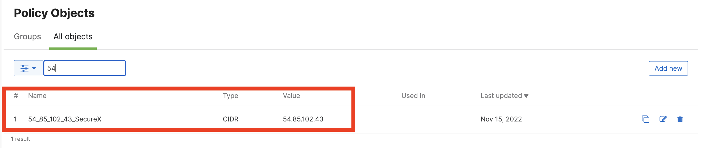

# Meraki - MX - add IP / FQDN to blocklist

This workflow add the given IP address or domain (FQDN) to Meraki Organization(s). 

## Requirements
*     Setup Workflow : 
    * 'Meraki - Setup - IP / FQDN Block kist - ObjectGroup and FW rules' need to be run first
*     The following system atomics are used by this workflow:
    * Meraki - Get Organizations
* 		The following atomic actions must be imported before you can import this workflow:
    * Meraki - Get Policy Object Groups list (available from my atomics gethub repository)
    * Meraki - Create Policy Object (available from my atomics gethub repository)
*     Cisco Meraki MX appliance(s)

## Workflow Steps

1. Validate supported observable type (IP or DOMAIN)
2. Fetch local variable (optional)
2. Get Organizations
3. Loop through each organization
4. Check the organization name is in scope (all if not specify)
5. Get a list of Policy Objects Groups
6. Create Policy Objects and add it to the IP or FQDN block list group

## Configuration
* Set the Organization Names local variable. If you leave this blank, all organizations will be updated
* Provide the workflow your Meraki API key by either:
Storing your token in a global variable and using the Fetch Global Variables group at the beginning of the workflow to update the Meraki API Key local variable; or
Disable the Fetch Global Variables group and add your token directly to the Meraki API Key local variable
* If you want to change the name of this workflow in the pivot menu, change its display name

## Targets
Target Group: `Default TargetGroup`

| Target Name | Type | Details | Account Keys | Notes |
|:------------|:-----|:--------|:-------------|:------|
| Cisco Meraki | HTTP Endpoint | _Protocol:_ `HTTPS` _Host:_ `api.meraki.com` _Path:_ `/api` | None | |
