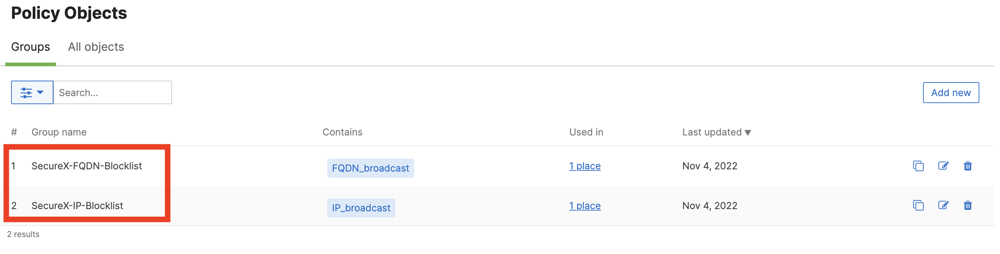
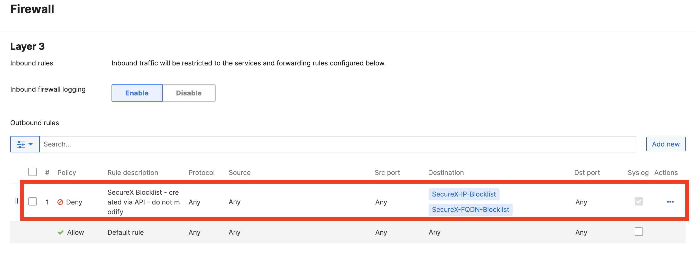

# Setup - IP / FQDN Block list - ObjectGroup and FW rules

This workflow create Meraki IP and FQDN Policy Object Group and FW rules for a given Organization. This is the initial setup for the workflow “Meraki - MX - add IP / FQDN to blocklist”

## Requirements

*     The following system atomics are used by this workflow:
    * Meraki - Get Networks by Organization
    * Meraki - Get Organizations
    * Meraki - Network - MX - Get L3 Outbound Firewall Rule
    * Meraki - Network - MX - Update L3 Outbound Firewall Rules
* 		The following atomic actions must be imported before you can import this workflow:
    * Meraki - Get Policy Objects Groups list (available from my atomics gethub repository)
    * Meraki - Create Policy Objects Group (available from my atomics gethub repository)
    * Meraki - Create Policy Object (available from my atomics gethub repository)
    * Meraki - Get Syslog Servers for a NetworkID (available from my atomics gethub repository)
*     Cisco Meraki MX appliance(s)

## Workflow Steps

1. Fetch local variable (optional)
2. Get Organizations
3. Loop through each organization
4. Check the organization name is in scope
5. Get a list of Policy Objects Groups
6. If Policy Objects Groups for IP or FQDN exist update local variables with ID
7. If Policy Objects Groups for IP or FQDN does not exist Create the Policy Object Groups
8. Create dummy Policy Objects to enable Policy Objects Groups (Policy Object Groups cannot add to a FW rule if empty)
9. Get Networks list for the organization
10. loop through each network
11. Get the list of Syslog servers
12. Set local variable SyslogEnable if Syslog server are defined
13. Get L3 Outbound Firewall Rules
14. Add new fw rules for IP and FQDN block list If they do not already exist.

## Configuration
* Set the Organization Names local variable
* Provide the workflow your Meraki API key by either:
Storing your token in a global variable and using the Fetch Global Variables group at the beginning of the workflow to update the Meraki API Key local variable; or
Disable the Fetch Global Variables group and add your token directly to the Meraki API Key local variable
* If you want to change the name of this workflow in the pivot menu, change its display name

## Targets
Target Group: `Default TargetGroup`

| Target Name | Type | Details | Account Keys | Notes |
|:------------|:-----|:--------|:-------------|:------|
| Cisco Meraki | HTTP Endpoint | _Protocol:_ `HTTPS` _Host:_ `api.meraki.com` _Path:_ `/api` | None | |
