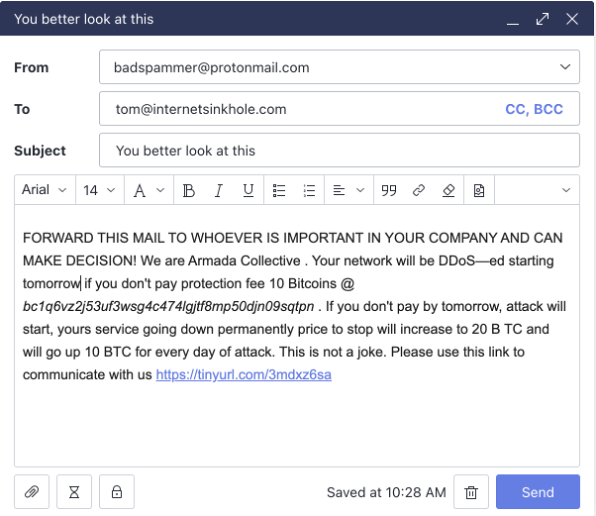
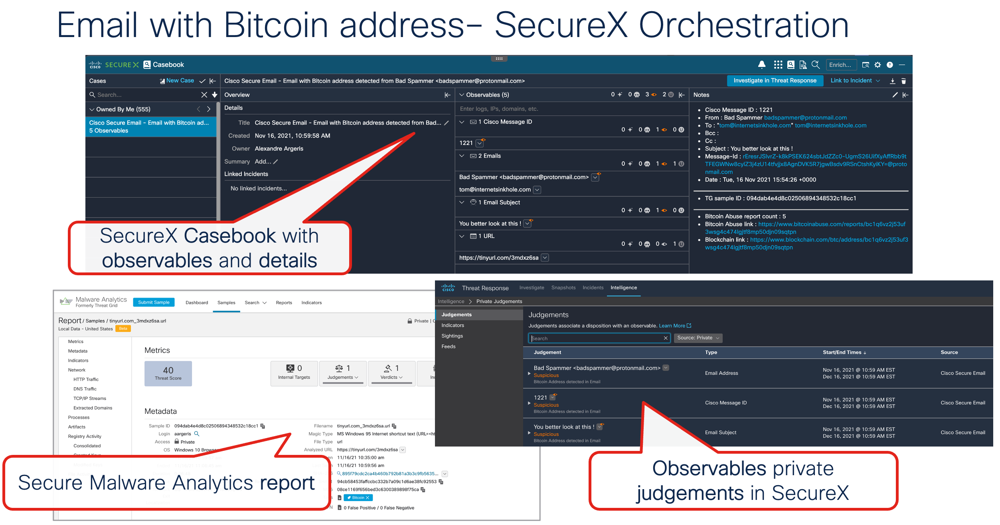

# Cisco Secure Email Bitcoin Address Detected

This workflow monitors a SecureX mailbox for incoming email with Bitcoin Address detected by Cisco Secure Email. When an email is received, the workflow get report from Bitcoinabuse for Bitcoin Address reputation. URL will be parse from the email body and send to Cisco Malware Analytics. A suspicious judgment will be set for Observables from the email. SecureX Casebook will be create with all details.

## Extra information
	Cisco Live DevNet-2107 https://www.ciscolive.com/on-demand/on-demand-library.html?search=2107#/session/1655424246651001Q9zx
  
  ## Requirements
    * The following system atomics are used by this workflow:
    * Threat Response - Generated Access Token
    * Threat Response - Inspect for Observables
    * Secure Malware Analytics - Submit URL
    * Threat Response - Create Casebook
    * IMAP inbox
    * The targets and account keys listed at the bottom of the page

## Workflow Steps

This workflow is designed to be triggered by an email arriving in a SecureX CES notification mailbox.

1.  Get Threat Response Access Token and Timestamp
2. For each email attach to the notification email:
	- Create a table with email headers.
3. For each headers:
	- Update variables with observable from the email headers.
4. If email matchl with Bitcoin Address regex
    	- Get Bitcoinabuse report 
5. If email match with URL regex 
    	- Submit URL to Cisco Secure Malware Analytics
6. Create observables json output.
7. Create SecureX judgment for observables
10. Casebook is created. 
