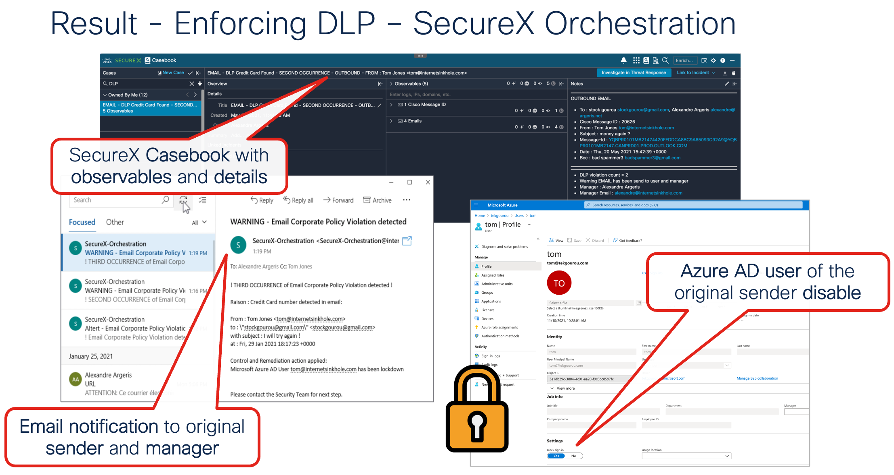

# Cisco Secure Email DLP Credit Card Detected

This workflow monitors a mailbox for incoming email with DLP breach detected by Cisco Secure Email. When an email is received, the workflow increase the number of occurrence for a single internal user from 1 to 3. At each occurrence the internal user is informed of the detection. At the second occurrence, is manager is also informed. At the third occurrence, the internal user Azure account is disable. 

## Requirements
*     The following system atomics are used by this workflow:
    * Threat Response - Generated Access Token
    * Threat Response - Inspect for Observables
    * Azure Graph - Get Access Token
    * Threat Response - Create Casebook
*     IMAP inbox
* The targets and account keys listed at the bottom of the page

## Workflow Steps

This workflow is designed to be triggered by an email arriving in a SecureX CES notification mailbox.

1. Identify if the notification email is for a inbound or outbound email.
2. Get Threat Response Access Token.
2. For each email attach to the notification email:
	- Create a table with email headers.
3. For each headers:
	- Update variables with observable from the email headers.
4. Create observables json output.
5. If inbound email, Update casebook title variable.
6. If outbound email, get manager name / email, increase DLP occurrence count.
7. If first occurence, notification/ policy email send to sender.
8. If second occurence, notification/ policy email send to sender and manager.
9. If third occurence, notification/ policy email send to sender/manager and sender user is disable in Azure AD.
10. Casebook is created. 

## Configuration

Account Keys/Targets
* 		You must create an account key with your mailbox’s credentials and then update the SecureX CEs notification Mailbox target with that account key. While you’re editing the target, be sure to add your email server’s information

## Targets
Target Group: `Default TargetGroup`

By default, the `Default TargetGroup` may not include `SMTP Endpoint` targets. If this is the case, you will need to update the target group and add `SMTP Endpoint` to the target types included.

| Target Name | Type | Details | Account Keys | Notes |
|:------------|:-----|:--------|:-------------|:------|
| [CTR_API] | HTTP Endpoint | _Protocol:_ `HTTPS` _Host:_ `visibility.amp.cisco.com` _Path:_ `/iroh` | CTR_Credentials | Created by default |
| Phishing Investigation Mailbox | IMAP Endpoint | Configured for your IMAP server | Phishing Investigation Mailbox Credentials | |
| Phishing Investigation Outgoing | SMTP Endpoint | Configured for your SMTP server | Phishing Investigation Mailbox Credentials | |
| [Private_CTIA_Target]| HTTP Endpoint | _Protocol:_ `HTTPS` _Host:_ `private.intel.amp.cisco.com` _Path:_ None | CTR_Credentials | Created by default |

## Account Keys

| Account Key Name | Type | Details | Notes |
|:-----------------|:-----|:--------|:------|
| [CTR_Credentials]({{ site.baseurl }}/account-keys/default#ctr_credentials) | SecureX Token | | See [this page]({{ site.baseurl }}/account-keys/securex-token) |
| Phishing Investigation Mailbox Credentials | Email Credentials | _Username:_ Mailbox Username _Password:_ Mailbox Password | |
